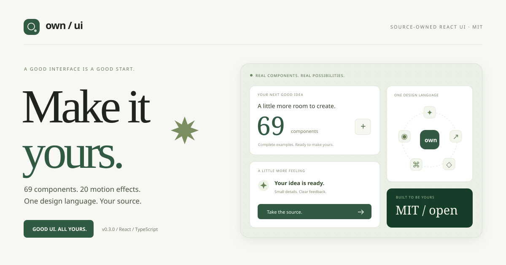

<div align="center">



# 好看的 UI，拿走就用。

**69 个组件 · 20 个动效 · 69 份完整示例 · MIT 开源**

把反复调整界面的时间，留给你的下一个想法。

[**探索组件 →**](https://olalall.github.io/own-ui/)　[**看宣传页 ↗**](https://olalall.github.io/own-ui/intro/)　[**下载 v0.3.0**](https://github.com/Olalall/own-ui/releases/tag/v0.3.0)

[](https://github.com/Olalall/own-ui/actions/workflows/ci.yml)
[](LICENSE)
[](https://react.dev/)
[](https://www.typescriptlang.org/)

</div>

**own-ui** 是一个能浏览、检索、真实操作、复制和安装的 React 组件库。统一设计语言，带齐源码和依赖文件；从按钮、表单到工作台与 Agent 界面，让下一个项目从一个好组件开始。

*Own the UI. Own the source. 69 interactive React components, 20 motion effects, complete examples, and a shadcn registry. Built with TypeScript and CSS Modules. MIT licensed.*

## 选一个喜欢的，放进你的项目

| 你会得到 | 怎么用 |
| --- | --- |
| **真实预览** | 点击、输入、展开与切换，看到组件实际的行为 |
| **完整源码** | 每项提供实现、示例、共享样式、主题与依赖文件 |
| **同一种设计语言** | 统一字体、间距、圆角与语义颜色，项目里用变量调整 |
| **按需交付** | 下载文件，或使用 shadcn CLI 安装；141 个 registry 条目 |
| **适度动效** | 流光、涟漪、倾斜、滚动、Dock、轨道与文字强调 |
| **清楚的边界** | 展示与交互在组件里，业务请求、路由、权限与持久化由项目管理 |

源码和示例以 MIT 开源，复制后的代码由你的项目管理。

## 69 个组件，从日常到复杂界面

| 分类 | 数量 | 你可以找到 |
| --- | ---: | --- |
| 基础与反馈 | **28** | 按钮、表单、选择、弹层、通知、折叠面板、面包屑、头像、轮播、环形进度 |
| Agent 与工具 | **6** | 消息、输入、任务状态、工具执行、审批、时间线 |
| 工作台 | **15** | 页头、列表、表格、筛选、设置、侧栏、命令菜单、文件树、分栏、步骤、日志 |
| 动效与视觉 | **20** | 流光、涟漪、渐变、倾斜、滚动、对比、Dock、轨道、文字强调 |

[打开组件目录](https://olalall.github.io/own-ui/) · [直接看看流光按钮](https://olalall.github.io/own-ui/?q=UiShineButton) · [直接看看命令菜单](https://olalall.github.io/own-ui/?q=UiCommandMenu)

展示网页呈现组件；独立宣传页使用库里的组件演示。预览画布保持白色，示例带有本地操作、禁用和空数据状态。组件详情提供完整源码、使用边界、来源与实际验证环境。

## 三步，带走一个组件

### 1. 挑选与操作

进入 [组件目录](https://olalall.github.io/own-ui/)，搜索组件名或用途，打开详情操作完整示例。

### 2. 复制或安装

在详情里下载所有文件，把 `components/ui/` 放进 React 项目；保留 LICENSE，启用 CSS Module，并安装该项声明的依赖。**组件本身不要求 Tailwind。**

也可以在已配置 shadcn、`components.json` 和 `ui` 别名的项目里运行：

```sh
pnpm dlx shadcn@4.21.4 add https://olalall.github.io/own-ui/r/shine-button-example.json
```

带 `-example` 的条目包含完整示例与全部依赖文件；不带后缀的条目只安装实现及依赖。覆盖已有同名文件前比较改动。

### 3. 放进页面，继续打磨

```tsx
import ShineButtonExample from "@/components/ui/examples/shine-button-example"

export default function Page() {
  return <ShineButtonExample />
}
```

同一份 React 源码可用于 Vite 与 Next.js。Next.js 的交互组件保留 `"use client"` 边界。Vue、Svelte、原生移动端需要各自实现；视觉变量与设计约定可以共用。

## 从零开始、替换现有、接入复杂项目

| 场景 | 使用方式 |
| --- | --- |
| 从零开始 | 挑选组件、映射主题变量、组合页面 |
| 替换现有 UI | 对接原来的状态与回调，按控件或页面逐项替换 |
| 复杂业务、多套 UI 并存 | 在项目层适配数据与行为，限定样式作用域，按模块迁移 |

Electron/Tauri 的 React 页面可按相同方式接入，桌面桥接由项目负责，尚未在真实桌面宿主验收。

[架构与取舍](docs/architecture.md) · [完整接入说明](docs/integration.md) · [交付规则](docs/component-delivery.md)

## 让它长成你的样子

默认变量在 `registry/ui/own-ui-theme.css`。用项目的全局样式覆盖：

```css
:root {
  --own-ui-primary: #365675;
  --own-ui-radius: 10px;
  --own-ui-card-radius: 16px;
}
```

颜色使用语义变量，深色主题由宿主映射。网站白色预览画布只属于展示站。动效支持 `prefers-reduced-motion`，连续动效提供暂停或静态方式。

## 在本地运行

需要 **Node.js 24+、pnpm 11.25.0** 与系统 tar。

```sh
git clone https://github.com/Olalall/own-ui.git
cd own-ui
pnpm install --frozen-lockfile
pnpm dev
```

打开终端显示的地址。组件目录在 `/`，宣传页在 `/intro/`。

```sh
pnpm build
pnpm preview --port 5173 --strictPort
```

`registry/ui/` 是组件和示例的源文件；`src/` 是展示站与宣传页。交付 JSON、registry 和下载包由构建脚本生成。

## 可重复的交付检查

```sh
pnpm verify:release
pnpm release:prepare
```

检查展示站构建、Vite 完整复制、官方 CLI 安装、Next.js 生产构建与 SSR，再比对源码、JSON、压缩包、registry 和 CLI 安装结果。公开源码包只收录允许公开的文件。

CI 覆盖 Windows 与 Linux。Pages 通过手动工作流部署，仓库子目录路径和 registry 地址由工作流设置。可通过 `OWN_UI_BASE_PATH` 与 `OWN_UI_REGISTRY_URL` 自定义地址。

[本版实际结果与限制](docs/release-0.3.0.md) · [按源码摘要记录的验证证据](docs/verification.json) · [GitHub 工作流](https://github.com/Olalall/own-ui/actions)

## 一起把好组件留下来

欢迎报告问题、提出组件需求或提交改进。请附上使用场景、复现步骤与截图。

[贡献规范](CONTRIBUTING.md) · [提交问题](https://github.com/Olalall/own-ui/issues/new) · [版本记录](CHANGELOG.md)

外部来源目录保留 **44 条调研记录**。own-ui 组件为独立实现，参考页面保留链接；依赖 Base UI 或 TanStack Table 的组件按需声明固定版本。付费模板或未核实素材不进入源码交付。

[来源调研](docs/open-source-libraries.md) · [动效与参考](docs/motion-components.md) · [第三方说明](THIRD_PARTY_NOTICES.md)

---

**Make it yours.**　MIT，详见 [LICENSE](LICENSE)。使用、修改和分发时保留版权与许可说明。
